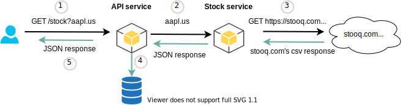

<div align="center">
    
</div>

# Python/Django Challenge

## Description
This project is designed to test your knowledge of back-end web technologies, specifically in Python/Django, Rest APIs, and decoupled services (microservices).

## Assignment
The goal of this exercise is to create a simple API using Django and the Django Rest Framework to allow users to query [stock quotes](https://www.investopedia.com/terms/s/stockquote.asp).

The project consists of two separate services:
* A user-facing API that will receive requests from registered users asking for quote information.
* An internal stock service that queries external APIs to retrieve the requested quote information.

For simplicity, both services will share the same dependencies (requirements.txt) and can be run from the same virtualenv, but remember that they are still separate processes.

## Minimum requirements
### API service
* Use Django's built-in features to create a user and a super user.
* Endpoints in the API service should require authentication (no anonymous requests should be allowed). Each request should be authenticated via Basic Authentication.

* User registration is done by passing the information in the body:

`POST /register`
```
  {
    "first_name": "Felipe",
    "last_name": "Sá",
    "email": "safelipesa@gmail.com",
    "password": "1234",
    "password_confirm": "1234",
    "is_superuser": true
  }
```
* Return:
  ```
    {
    "id": 16,
    "first_name": "Felipe",
    "last_name": "Sá",
    "email": "safelipesa@gmail.com",
    "is_superuser": true
  } 
  ```

* The login is done and the token is stored in the cookie:

`POST /login`
```
  {
    "email": "safelipesa@gmail.com",
    "password": "1234",
  }
  ```
* Return:
  ```
  {
    "jwt": "eyJ0eXAiOiJKV1QiLCJhbGciOiJIUzI1NiJ9.eyJ1c2VyX2lkIjoxNiwiZXhwIjoxNjM0MTYwMzU0LCJpYXQiOjE2MzQxNTY3NTR9.   9IyI9n3jXfpq7pgyk2L1TwOR0X_kda5_HG3I7JFqkNY"
  }
  ```
* After login, you are ready to use the other services, to log out:

  `POST /logout`

* Return:
  ```
  {
    "message": "Logged out"
  }
  ```

* When a user makes a request to get a stock quote (calls the stock endpoint in the api service), if a stock is found, it should be saved in the database associated to the user making the request.
* The response returned by the API service should be like this:

  `GET /stock?q=aapl.us`
  ```
    {
    "name": "APPLE",
    "symbol": "AAPL.US",
    "open": 123.66,
    "high": 123.66,
    "low": 122.49,
    "close": 123
    }
  ```
* A user can get his history of queries made to the api service by hitting the history endpoint. The endpoint should return the list of entries saved in the database, showing the latest entries first:
  
  `GET /history`
  ```
  [
      {"date": "2021-04-01T19:20:30Z", "name": "APPLE", "symbol": "AAPL.US", "open": "123.66", "high": 123.66, "low": 122.49, "close": "123"},
      {"date": "2021-03-25T11:10:55Z", "name": "APPLE", "symbol": "AAPL.US", "open": "121.10", "high": 123.66, "low": 122, "close": "122"},
      ...
  ]
  ```
* A super user (and only super users) can hit the stats endpoint, which will return the top 5 most requested stocks:

  `GET /stats`
  ```
  [
      {"stock": "aapl.us", "times_requested": 5},
      {"stock": "msft.us", "times_requested": 2},
      ...
  ]
  ```
* All endpoint responses should be in JSON format.

### Stock service
* Assume this is an internal service, so requests to endpoints in this service don't need to be authenticated.
* When a stock request is received, this service should query an external API to get the stock information. For this challege, use this API: `​https://stooq.com/q/l/?s={stock_code}&f=sd2t2ohlcvn&h&e=csv​`.
* Note that `{stock_code}` above is a parameter that should be replaced with the requested stock code.
* You can see a list of available stock codes here: https://stooq.com/t/?i=518

## Architecture

1. A user makes a request asking for Apple's current Stock quote: `GET /stock?q=aapl.us`
2. The API service calls the stock service to retrieve the requested stock information
3. The stock service delegates the call to the external API, parses the response, and returns the information back to the API service.
4. The API service saves the response from the stock service in the database.
5. The data is formatted and returned to the user.

## Bonuses
The following features are optional to implement, but if you do, you'll be ranked higher in our evaluation process.
* Add unit tests for the bot and the main app.
* Connect the two services via RabbitMQ instead of doing http calls.
* Use JWT instead of basic authentication for endpoints.

## How to run the project
* Create docker images: `docker-compose build`
* Run services: `docker-compose up`

__Important:__ If your implementation requires different steps to start the services
(like starting a rabbitMQ consumer), document them here!
